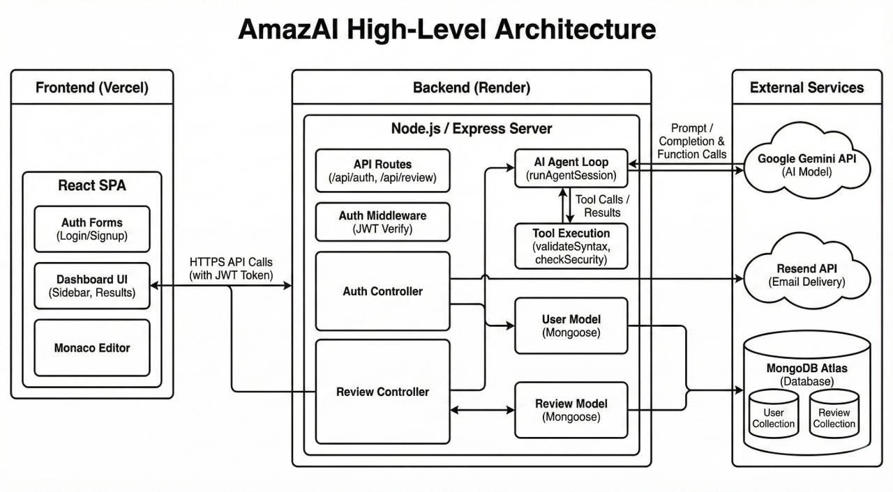
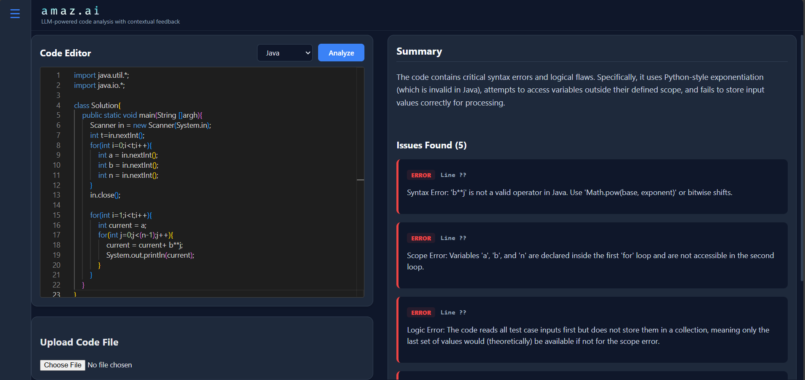

# AmazAI - Agentic AI Code Review Platform

AmazAI is an advanced, agentic code review platform designed to mirror a professional IDE experience. Unlike standard chatbots, AmazAI uses an autonomous Agent Loop to deterministically validate code syntax and security before generating feedback, ensuring high-accuracy, hallucination-free reviews.

## Key Features

- Agentic AI Workflow: Orchestrates Google Gemini's Tool Calling to run local AST parsers (Acorn) and Regex security scanners before generating a review.

- Deterministic Security: Detects hardcoded secrets (API keys, passwords) and syntax errors with mathematical certainty, not just probabilistic guessing.

- Fallback Inference Queue: Automatically reroutes AI requests through a multi-model chain (Flash Preview → Flash → Flash-lite) to ensure 99.9% uptime during rate limits.

- IDE-Like Experience: Features a Fixed-Viewport layout with Monaco Editor integration, supporting syntax highlighting and real-time "Red Line" error mapping.

- Production-Grade Auth: Secure, stateless JWT Authentication with Google OAuth support and Resend API integration for transactional email verification.

## Tech Stack

- Frontend: React.js (Vite), Monaco Editor, Tailwind CSS, Lucide React
- Backend: Node.js, Express.js, JWT, Cookie-Parser
- AI Engine: Google Generative AI SDK (Gemini 1.5 Flash), Tool Calling
- Database: MongoDB (Mongoose)
- Infrastructure: Vercel (Frontend), Render (Backend), Resend API (Email)

## High Level Architecture

## How It Works

- Input: User provides code via the Monaco Editor or File Upload.

- Pre-Check: The Backend runs an Agent Loop where the LLM can request to "run tools" (Syntax Validation, Security Scan).

- Execution: Tools execute locally on the server (AST parsing/Regex).

- Synthesis: The LLM receives tool outputs and generates a context-aware JSON review.

- Response: The Frontend maps the JSON response to visual markers in the editor and a structured markdown report.

## Status

Initial project setup completed & deployed.
Deployed url : [URL](https://ai-code-reviewer-frontend-eight.vercel.app/)

## User Interface

